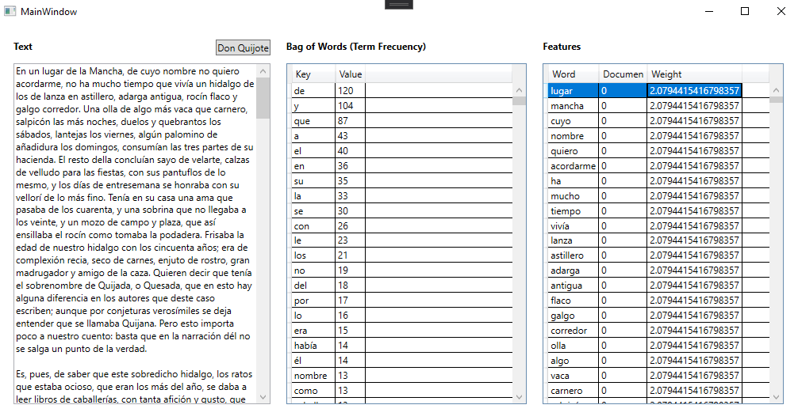

# Feature Extraction

This is a simple example of a feature extraction algorithm for natural language processing made for 
"Decision Support Systems" Assignment of FASTA University.

Two simple algorithms are demostrated:
- Bag of Words: This algorithm extracts the words from the text and counts the number of times they appear.
- TF-IDF: This algorithm calculates a weight for each word in the text based on the frequency of the word in the text and the frequency of the word in the corpus.

The example includes a simple UI made in WPF.